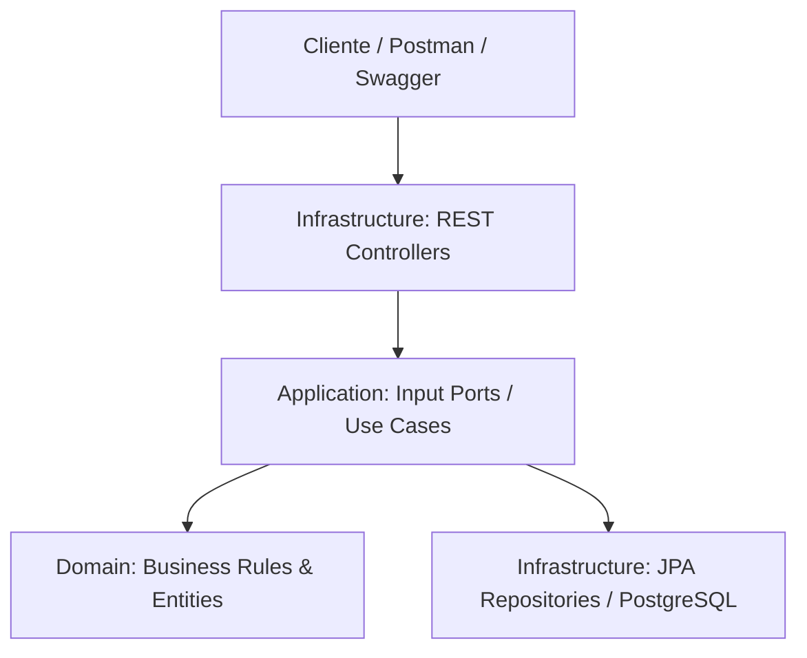

# App Entidad Financiera

Backend REST para la administración de clientes, productos financieros (cuentas) y transacciones de una entidad financiera. Desarrollado como prueba técnica siguiendo arquitectura hexagonal.

## Tecnologías

- Java 21, Spring Boot 3.3.x, Maven
- PostgreSQL 16 + Flyway (migraciones versionadas)
- JUnit 5, Mockito, AssertJ, Testcontainers
- Docker y Docker Compose
- springdoc-openapi (Swagger UI)

## Arquitectura

Arquitectura hexagonal (ports & adapters). El dominio (`domain/`) no depende de Spring ni JPA; la aplicación (`application/`) orquesta casos de uso a través de puertos (interfaces); la infraestructura (`infrastructure/`) implementa los adaptadores concretos (REST, JPA).

Ver `docs/acid.md` para el detalle de cómo se garantizan las propiedades ACID en las transacciones.

## Requisitos previos

- Docker y Docker Compose
- (Opcional, para desarrollo local sin Docker) Java 21 y Maven

## Instalación y ejecución

### Con Docker (recomendado)

\`\`\`powershell
git clone https://github.com/TU_USUARIO/app-entidad-financiera.git
cd app-entidad-financiera
Copy-Item .env.example .env   # completar credenciales si aplica
docker compose up --build -d
\`\`\`

La API queda disponible en `http://localhost:8080`. Swagger UI en `http://localhost:8080/swagger-ui.html`.

### Ejecución local (sin Docker)

\`\`\`powershell
docker compose up -d db   # solo la base de datos
Get-Content .env | ForEach-Object { $parts = $_ -split '=', 2; [System.Environment]::SetEnvironmentVariable($parts[0], $parts[1]) }
mvn spring-boot:run
\`\`\`

## Variables de entorno

| Variable | Descripción |
|---|---|
| DB_NAME | Nombre de la base de datos |
| DB_USER | Usuario de PostgreSQL |
| DB_PASSWORD | Contraseña de PostgreSQL |

## Base de datos

Modelo relacional: `clientes (1)—(N) cuentas (1)—(N) movimientos (N)—(1) transacciones`. DDL completo en `docs/ddl.sql`, ejemplos de DML en `docs/dml-ejemplos.sql`.

## Endpoints principales

Ver tabla completa en Swagger UI. Resumen:

| Módulo | Endpoints |
|---|---|
| Clientes | CRUD completo en `/api/clientes` |
| Cuentas | Crear, consultar, cambiar estado en `/api/cuentas` |
| Transacciones | Consignaciones, retiros, transferencias, consulta de estado de cuenta en `/api/transacciones` |

## Pruebas

\`\`\`powershell
mvn test
\`\`\`

Cobertura: pruebas unitarias de Service y Controller para los 3 módulos, más una prueba de integración con Testcontainers que valida el flujo completo cliente-cuenta-transferencia contra PostgreSQL real.

## Estructura del proyecto

\`\`\`
src/main/java/com/entidadfinanciera/app/
├── domain/          # Modelos y reglas de negocio puras
├── application/     # Casos de uso y puertos
├── infrastructure/  # Adapters REST y JPA
└── config/          # Configuración transversal (CORS, OpenAPI, seguridad)
\`\`\`

## Estrategia Git

Git Flow: `main` (estable) ← `develop` (integración) ← `feature/*` (por funcionalidad). Ver historial de Pull Requests en GitHub para evidencia de avance.

## Decisiones técnicas relevantes

- **Arquitectura hexagonal** sobre MVC clásico: aísla las reglas de negocio de Spring/JPA, facilita testing sin base de datos real.
- **Tabla única `cuentas`** con campo `tipo_cuenta` en vez de tablas separadas por tipo: ambos tipos comparten 100% de los atributos.
- **Tabla `movimientos` separada de `transacciones`**: modela correctamente que una transferencia genera 2 movimientos (débito/crédito) sobre 1 transacción.
- **Sin autenticación/autorización**: fuera del alcance solicitado por la prueba técnica; en producción se agregaría Spring Security con JWT y roles.
- **`saldo disponible` = `saldo`**: el sistema no maneja retenciones, por lo que ambos valores son equivalentes en todo momento.

## Principios SOLID aplicados

## Principios SOLID aplicados

- **Single Responsibility Principle (SRP):** Los Controllers mapean peticiones HTTP, los Services orquestan la lógica de negocio y los Adapters JPA manejan únicamente la persistencia.
- **Open/Closed Principle (OCP):** Uso de enums y estrategias polimórficas (`TipoCuenta`, `TipoTransaccion`) que permiten extender la funcionalidad sin modificar la lógica central.
- **Liskov Substitution Principle (LSP):** Los adaptadores de infraestructura (`ClienteRepositoryAdapter`) implementan los puertos (`ClienteRepositoryPort`) de forma totalmente sustituible sin romper el comportamiento del dominio.
- **Interface Segregation Principle (ISP):** Interfaces delgadas para los casos de uso (`CrearClienteUseCase`, `RealizarTransferenciaUseCase`), evitando contratos monolíticos.
- **Dependency Inversion Principle (DIP):** El dominio y la aplicación dependen exclusivamente de abstracciones (puertos) inyectadas desde la infraestructura mediante Spring.